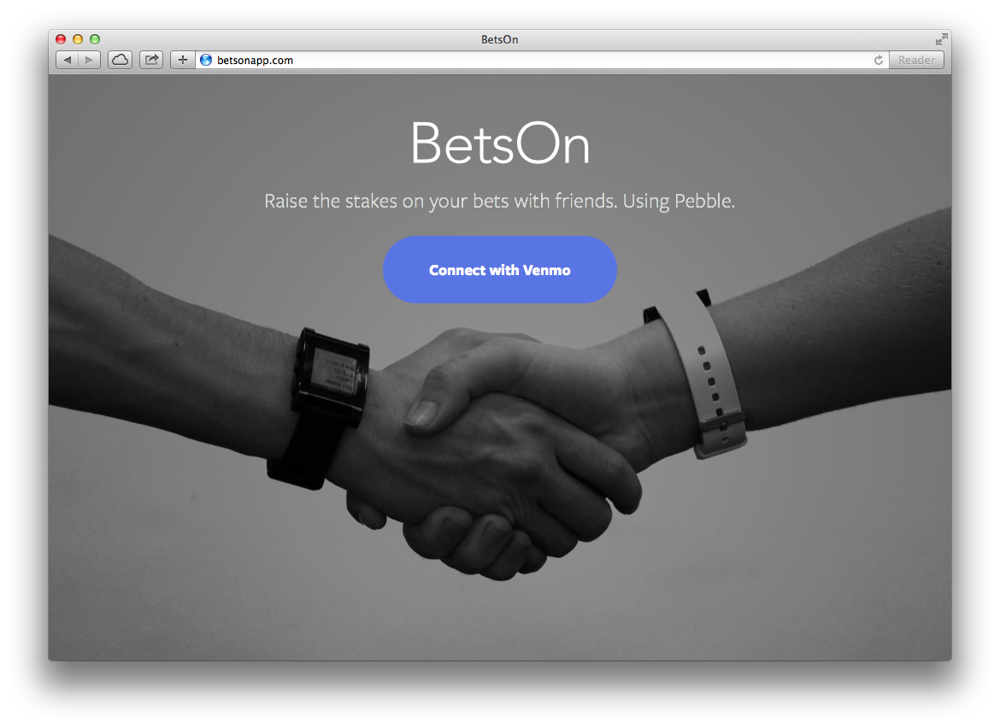
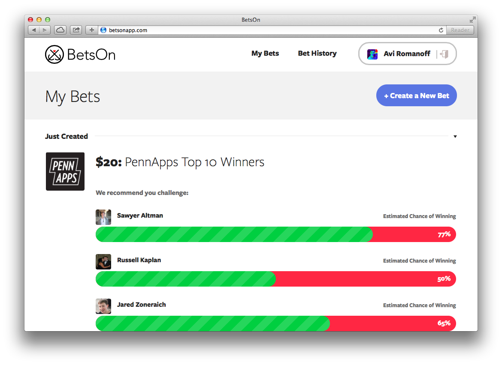
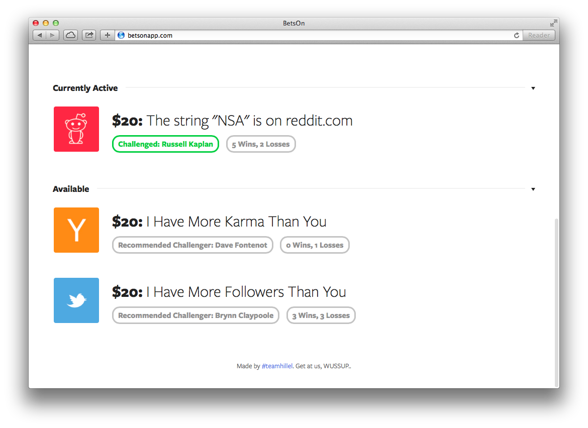
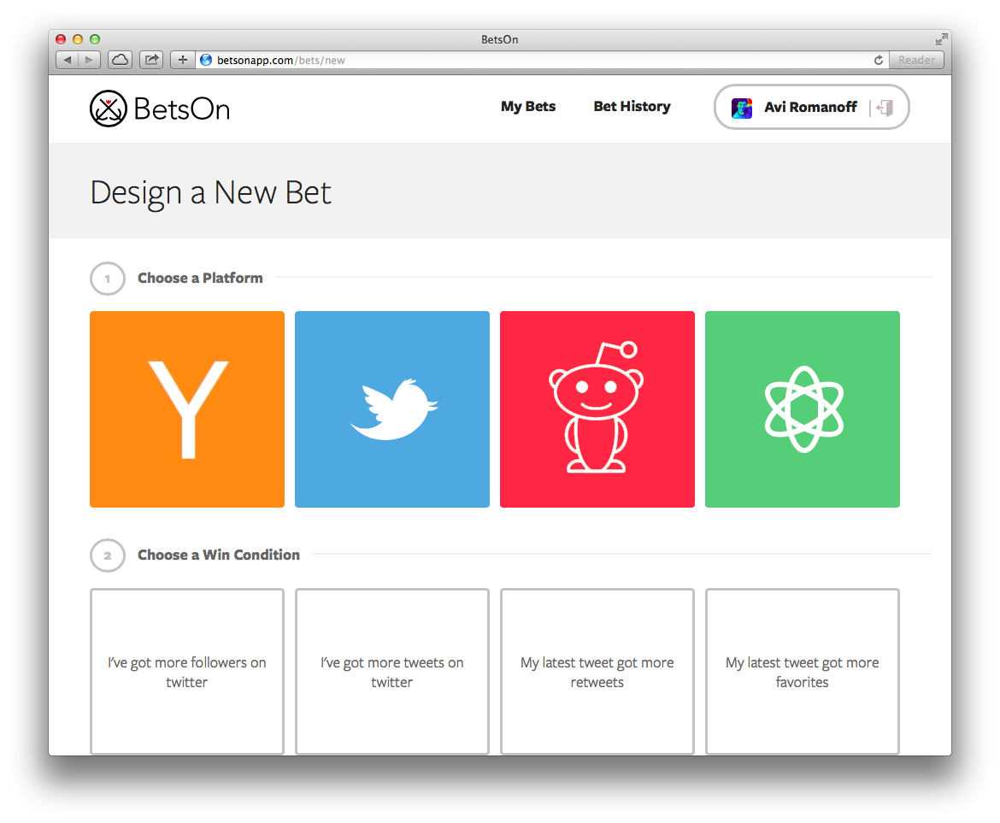

  
What

  <ul>
    <li>Built in under 40 hours as part of the Spring 2014 PennApps Hackathon at The University of Pennsylvania.</li>
    <li>Winner of the "It Just Works" prize, sponsored by Dropbox.
    
 BetsOn is the easiest, most sophisticated, and most natural way to make bets with your friends. Select a custom-built or preset bet on your Pebble and shake hands with your Pebble-wearing friend. Your bet is now sealed: BetsOn shares your bet on your social media and will verify the winning condition programmatically, hooking into Venmo to make sure the loser pays up.
        Browse our preexisting bets or create your own with an If-This-Then-That-style editor. Example: create a bet that the phrase "BetsOn" appears on the URL "pennapps.com/winners" on 2/16/14.
    

  </ul>

  
How

  
<i>Coming soon</i>

  
  
  
  

