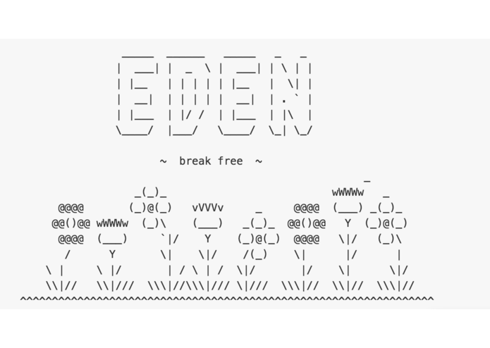

  
What

  <ul>
    <li>Built in under 40 hours as part of the Winter 2015 PennApps Hackathon at The University of Pennsylvania.</li>
    <li>Winner of the "Best Cloud Hack" prize, sponsored by Linode.
    
 We built a platform that lets you to break free from Apple's walled garden.

With Eden, you can deploy a personal OS X instance on Amazon EC2, Linode, or any other cloud provider in minutes, and use it to securely relay iMessage to any platform -- including Android, Windows Phone, and the Web.

Eden is made possible by the tremendous efforts of the hackintosh and emulation communities to virtualize OS X and run it on non-Apple hardware. By standing on the shoulders of giants, Eden enables you to climb out of the locked-down Apple ecosystem and access your services and data on your terms, on any platform.
    

  </ul>

  
How

  
<i>Coming soon</i>

  

