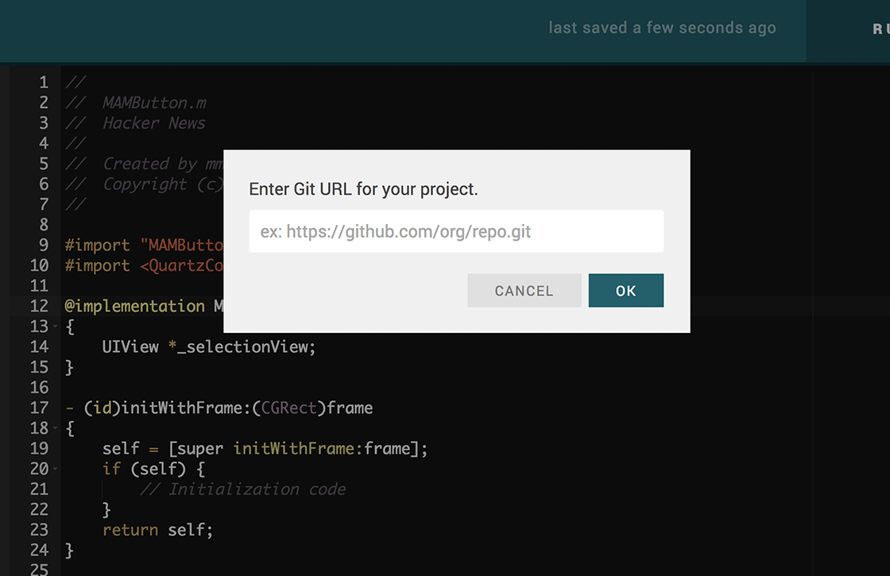
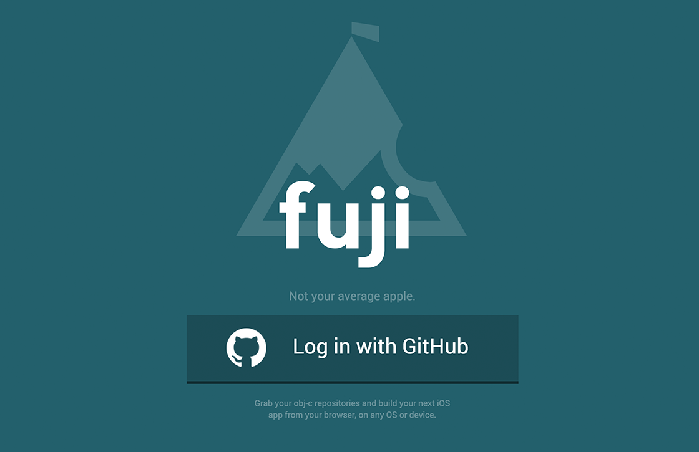
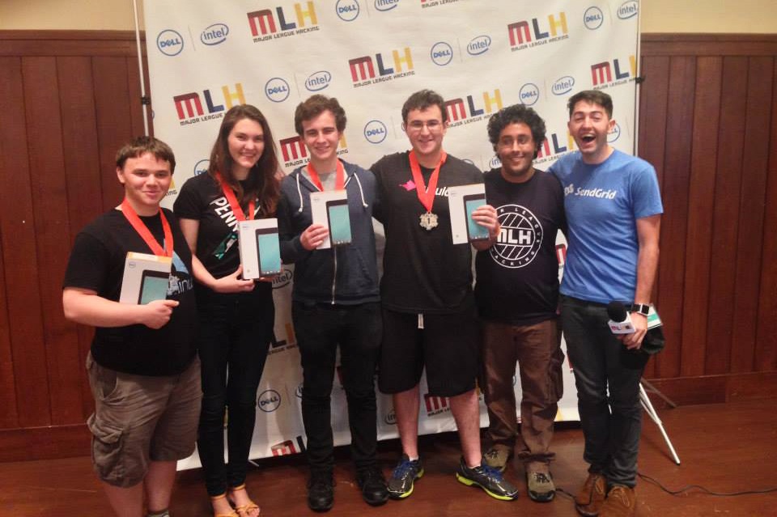

  
What

  <ul>
    <li>Built in under 40 hours as part of the Fall 2014 PennApps X Hackathon at The University of Pennsylvania.</li>
    <li>Grand Prize winner &amp; recipient of the &quot;Best User Experience&quot; award, sponsored by Goldman Sachs.
    
 Fuji is like Xcode in your browser. It's a fully functional web IDE for developing iOS apps in your browser.You can log in with GitHub, immediately edit and commit to your projects, and view your work instantly in an iPhone simulator directly in your browser.
    

  </ul>

  
How

  
<i>Coming soon</i>

 

  
  
  
  

