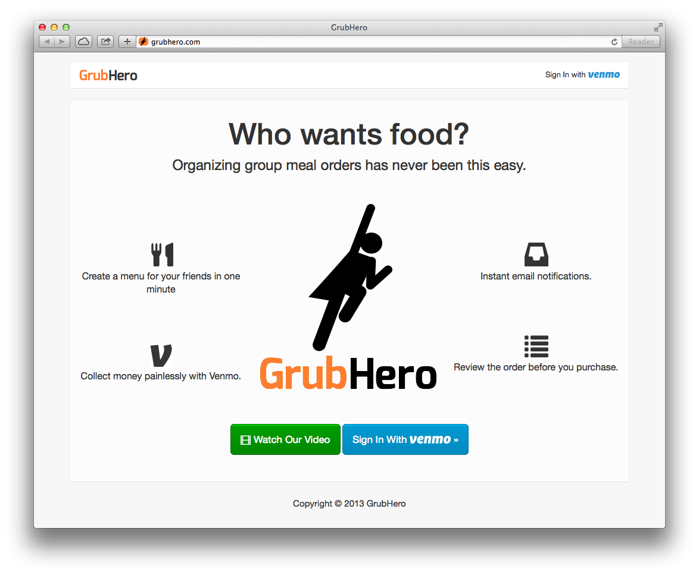
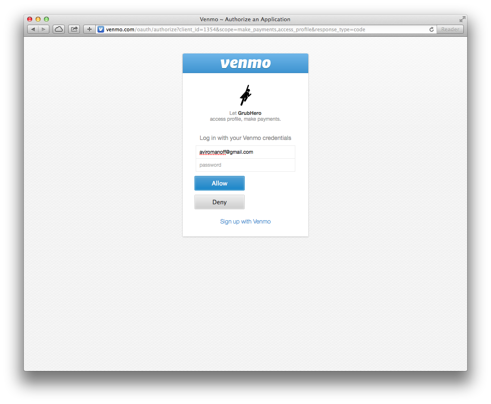
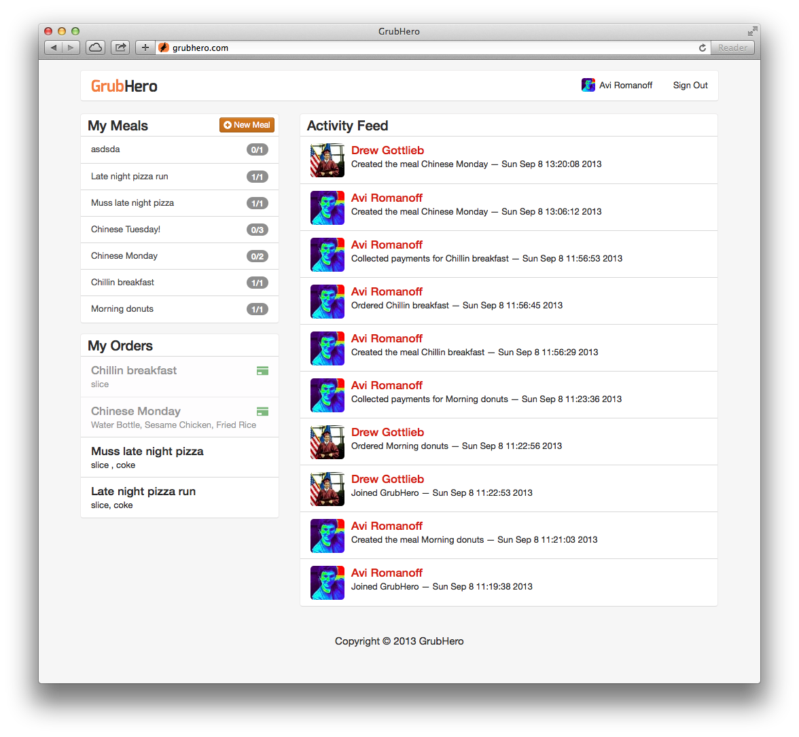
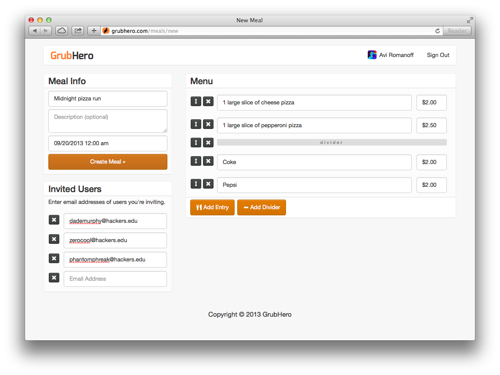
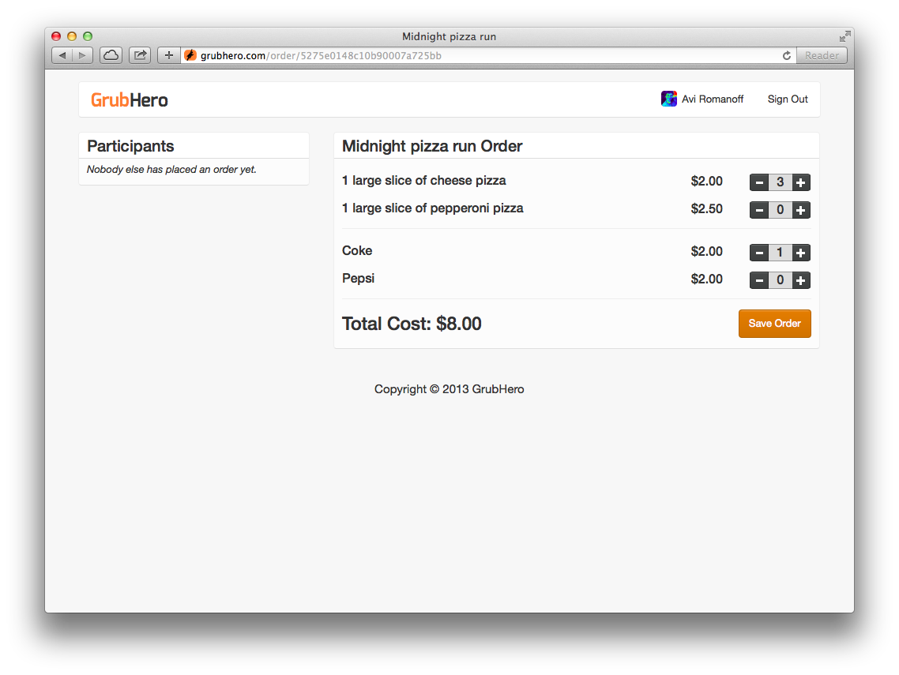
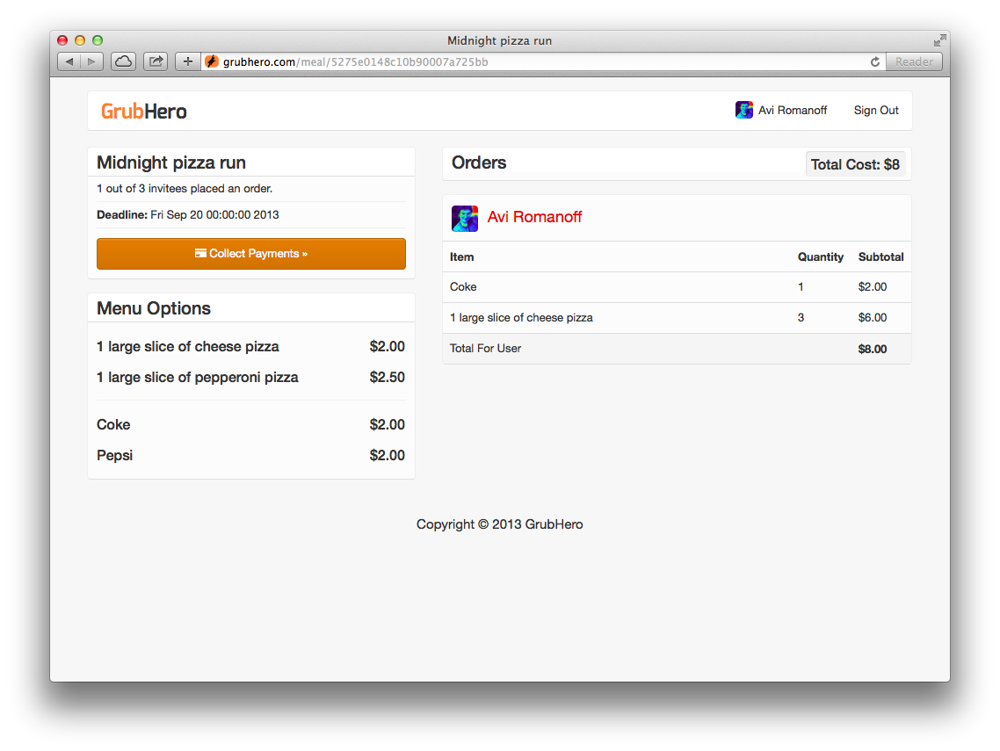

  
What

  <ul>
    <li>Built in 48 hours as part of the Fall 2013 PennApps Hackathon at The University of Pennsylvania.</li>
    <li>My partner and I created a platform for facilitating and coordinating group meal ordering &mdash; including payments.</li>
    <li>User accounts, and financial transcations are handled via Venmo, the leading platform for mobile social payments.</li>
    <li>Features include Facebook integration, real-time email notifications, a personalized activity feed, and powerful menu online menu creation tools.</li>
  </ul>

  
  
  
  
  
  

