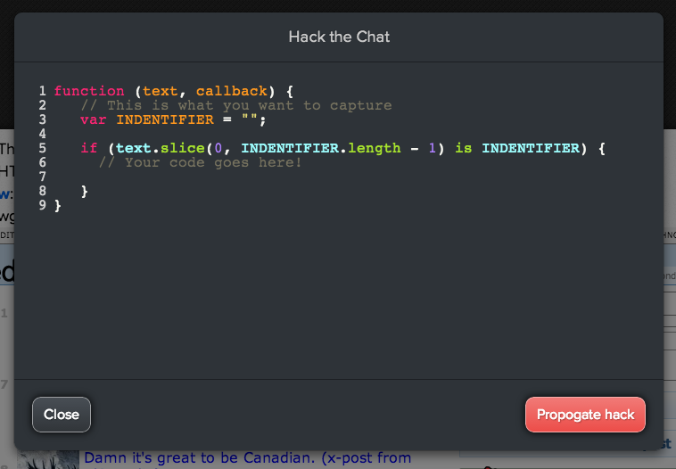

  
What

  <ul>
    <li>Built in 24 hours as part of the Fall 2013 PilotPhilly Hackathon at The University of Pennsylvania.</li>
    <li>My partner and I created a real-time multi-user chat program that can be hacked (extended) in real time using a custom JavaScript API.</li>
    <li>Built-in hacks includes XKCD image display support and full website embed support (via iframes).</li>
    <li>Hacking is done through a complete in-browser code editor, and propogated and executed in realtime to all connected users.</li>
    <li>My partner in creating this project has written up <a style="text-decoration:underline" href="http://lablayers.deviantart.com/journal/My-Weekend-at-PilotPhilly-412888323">a lengthy blog</a> post chronicling our experience at the hackathon.</li>
  </ul>

  
  
  
  
  

