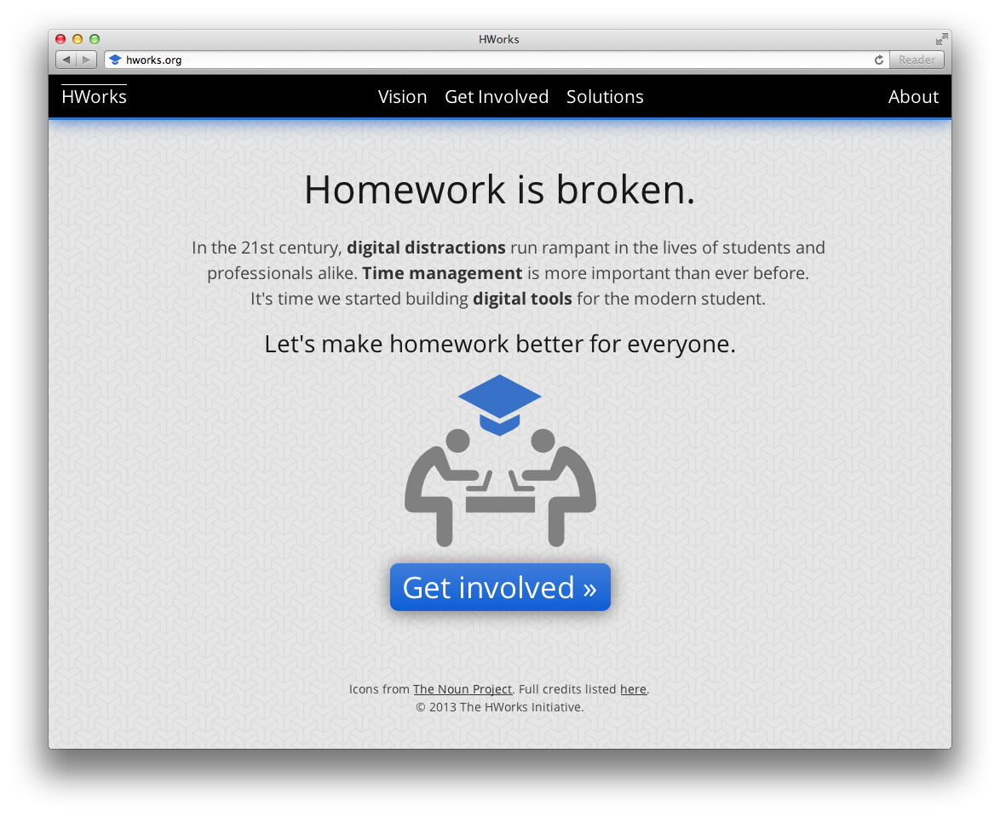
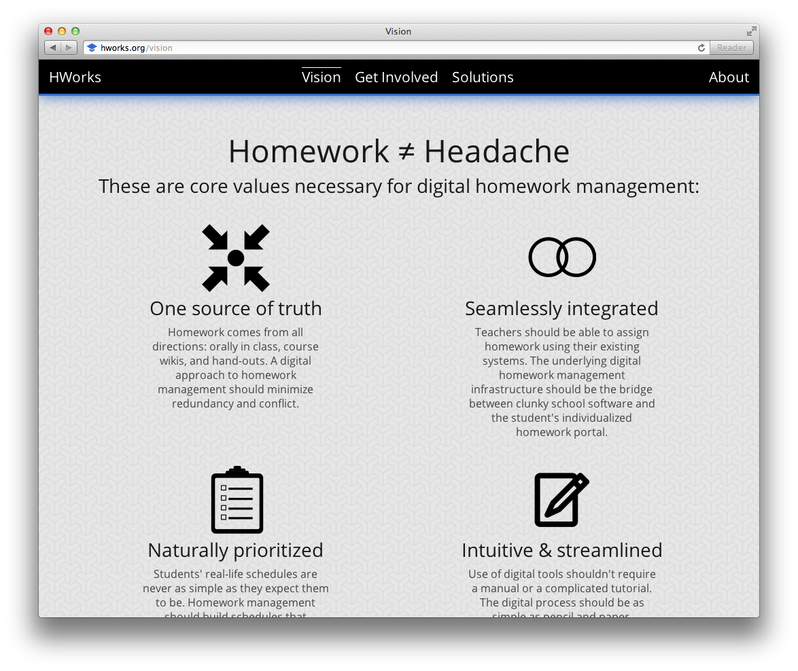

  
Why

  
Based on my experiences in conceiving and developing Keeba, I began investigating the need for modern, intuitive, homework management software on a global scale. I extracted the core values with which I built Keeba, and articulated them as a broader vision for what next-generation digital homework management systems should strive for. I created an online organization, HWorks, as a collaborative hub for exploring these ideas and collecting the individual efforts made by students around the country and the world to address similar issues in their own schools.

  
How

  
The HWorks website is uses modern responsive CSS techniques to adapt its presentation to the various display sizes it might be viewed on. The website is completely static and is hosted via GitHub Pages.

  
  

