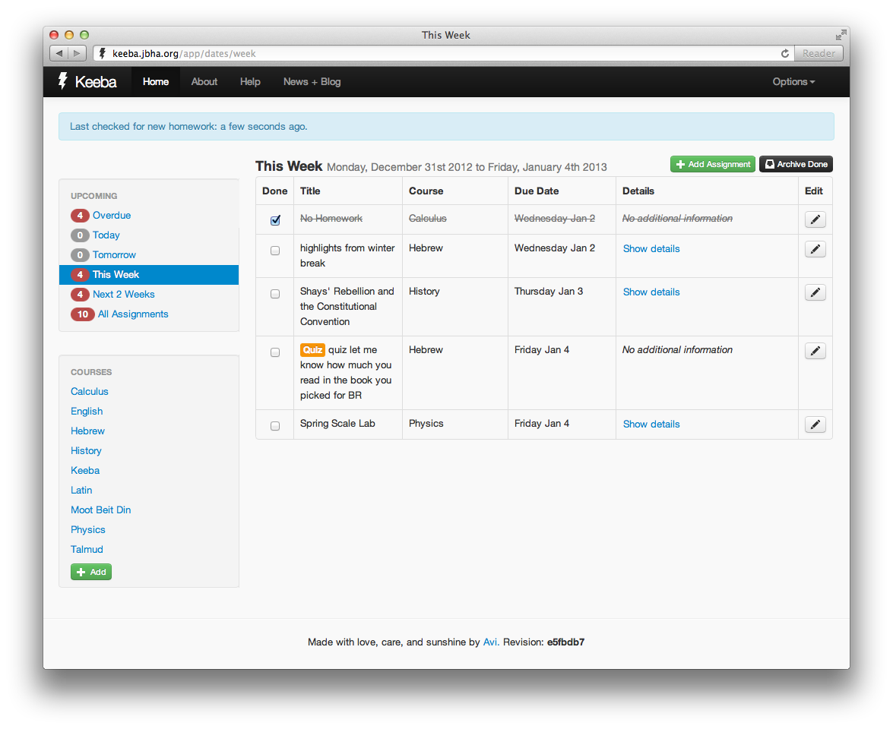

  
What

  <ul>
    <li>Reverse-engineered school’s existing homework website and created scraping API</li>
    <li>Designed and coded complete reimagination of web UI focusing on responsive design and realtime interaction, dramatically increasing student productivity</li>
    <li>Architected and built highly concurrent backend to interface with existing website and expose internal APIs to web clients on desktop and mobile</li>
    <li>Since launching in June 2012, 90% of the student body is using Keeba to track 55,000+ assignments across 2,000+ courses.</li>
  </ul>

  
Why

  
My high school’s homework website left much to be desired in terms of usability, functionality, and intuitiveness. To address these problems without requiring teacher re-training or other involvement from the school’s administration, as a sophomore in high school, I reverse-engineered the existing homework website and provided an alternative interface to access. It grew quickly from a simple set of parsing algorithms and an HTTP proxy API for my personal use to a state-of-the-art personal productivity web app with wide adoption by my school community.

  
How

  
Keeba is a client-heavy single-page style web app which makes heavy use of JavaScript and CoffeeScript. The client embraces the modern JavaScript MVC pattern (through Backbone) and the server is a highly modularized set of internal and external APIs. Keeba uses makes heavy use of UNIX IPC and process forking to maintain a high degree of concurrency and avoid clogging the eventloop.

  
  

