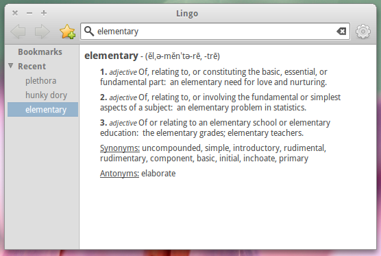

  
What

  <ul>
    <li>Identified need for easy to use, fast, and feature-rich dictionary program for Linux desktops</li>
    <li>Built application for Ubuntu-based Linux desktops featuring search suggestions, search history, bookmarking and pronunciation guides using Wordnik dictionary API</li>
    <li>Lingo shipped with elementaryOS Jupiter, which has been downloaded 200,000+ times since its launch in 2011</li>
    <li>In recognition of this, was voted in to serve on Executive Council of elementary Project</li>
  </ul>

  
Why

  
Lingo is not a completely separate project from Purple (see below), but rather a completely re- architected rewrite, that will replace and succeed Purple. The purpose of the rewrite was to greatly improve performance (Lingo is written in a language that compiles into binary, unlike Purple which relies of the resource-taxing Python environment), improve modularity, internationalization capabilities, and portability. Additionally, as Wordnik provides no official wrapper or support for the Vala programming language, I needed to design and implement my own wrapper to interface with their API. Like Lingo, the program is licensed under the GNU GPL version 3. It will be included in the upcoming release of elementaryOS, code-named Luna.

  

