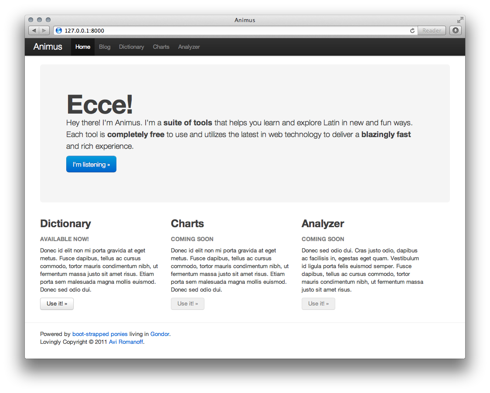
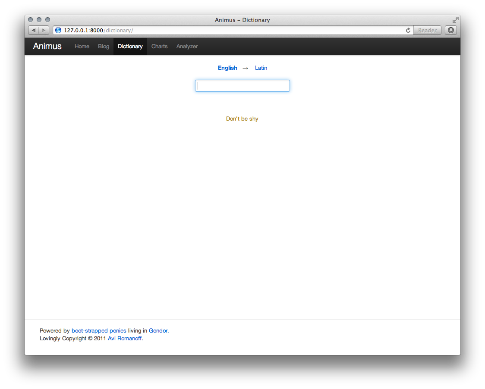
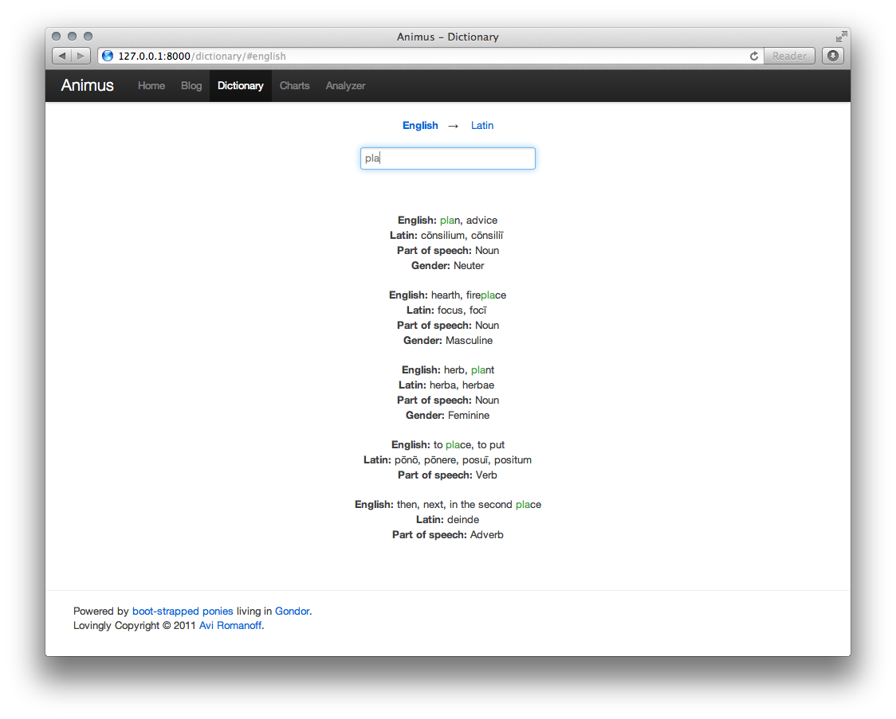
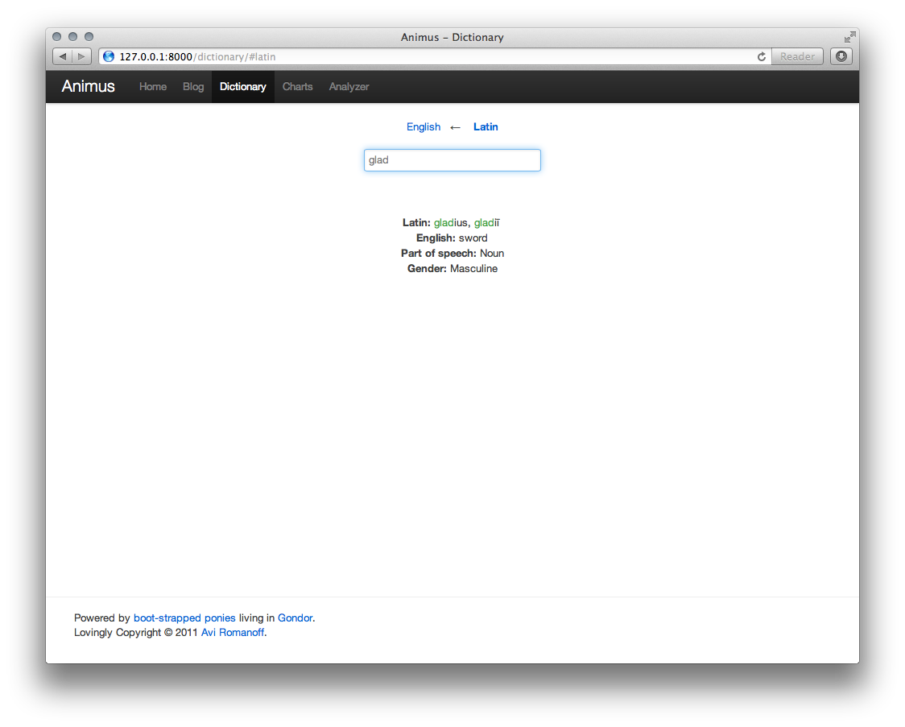

  
Why

  
As I student of Latin at my high school, my classmates and I (and Latin students around the world) struggle with a lack of modern (technologically speaking), easy-to-use, and fast digital Latin dictionaries. As a requirement of my Latin course, I maintain a list of all of the Latin vocabulary that I learn in class on a Word document. To help my own studies and my classmates', I created a website and API that allows anyone to search my Latin dictionary Word document, which I parsed and stored in a relational database. The website searches using a clean and elegant minimalistic interface with real-time, as-you-type, results. It can search in either Latin or English.

  
  
  
  

