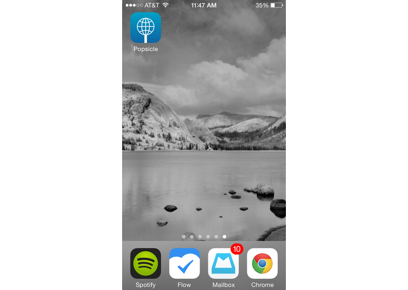
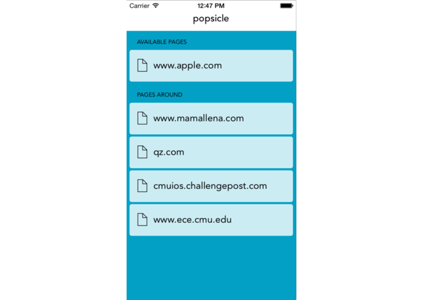
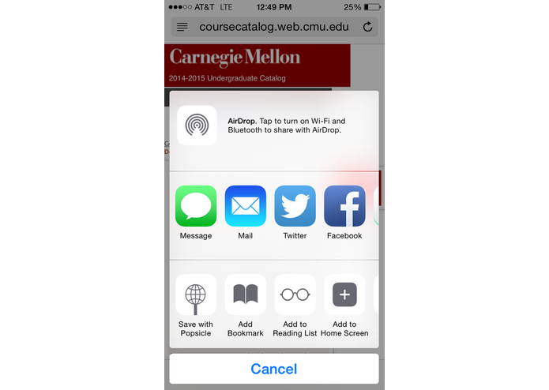
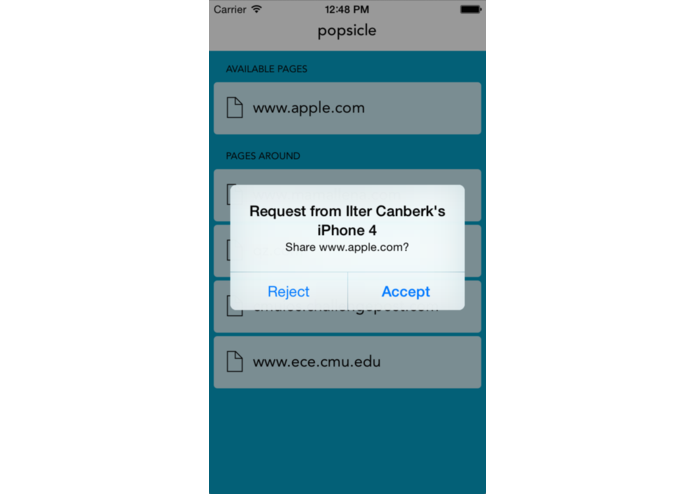
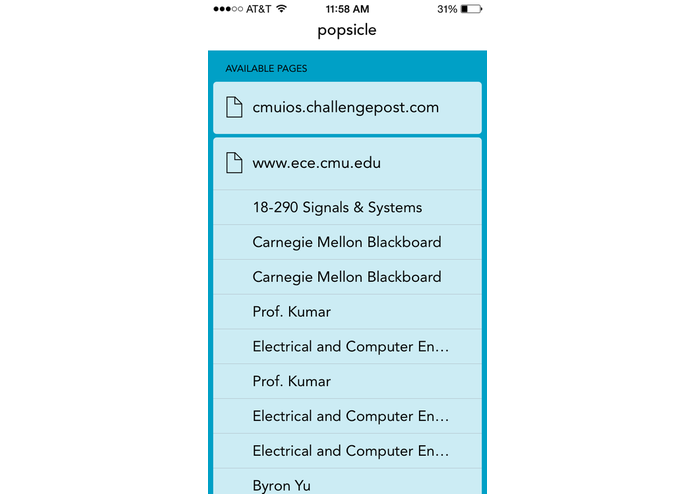
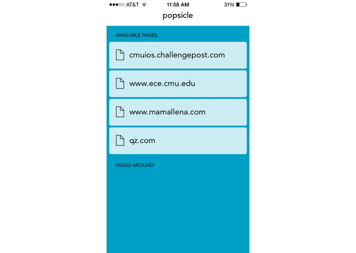

  
What

  <ul>
    <li>Built in a weekend as part of Apple's Fall 2014 iOS App Challenge at Carnegie Mellon University.</li>
    <li>First Prize winner.
    
<h4>Browse the Internet without The Internet</h4>

What if you could browse the Internet in Airplane mode? Through the power of sharing, caring, and iOS 8 — you can. Open any website in Safari, tap the "Save with Popsicle" button, and the entire website is saved for offline browsing — including links, images, and styles. You can even click links on the page and browse them offline as well, using our intelligent spidering algorithm.

<h4>Even if you never downloaded it</h4>

Stuck on a plane without a recent copy of the New York Times? Someone on board probably has your back. Popsicle can connect via Bluebooth or peer-to-peer WiFi to transfer caches between users. Just tap on the website you want to download from another popsicle user, and in a matter of seconds you'll be reading the latest edition.
    

  </ul>

  
How

  
<i>Coming soon</i>

 

  
  
  
  
  
  

