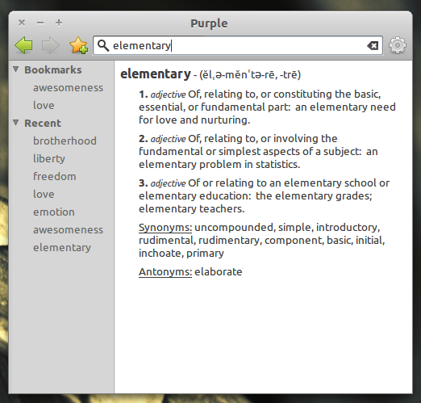

  
Why

  
I recognized that Linux lacked an easy to use and functional desktop dictionary. I therefore created this program to provide a graphical front end to Dictionary.com's (and later Wordnik's) web services, enhanced with tools such as bookmarking and automatic flashcard generation. This program is fully open source and is hosted on Ubuntu's code development platform, Launchpad. It is licensed under the GNU GPL version 3, and shipped in the initial release of the elementaryOS operating system, code-named Jupiter.

  
  
  

